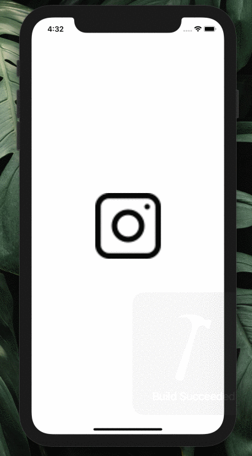

# Parstagram 

This is an Instagram clone with a custom Parse backend that allows a user to post photos, view a global photos feed, and add comments!

## User Stories

The following **required** functionality is completed:

- [X] User sees app icon in home screen and styled launch screen. 
- [X] User can sign up to create a new account.
- [X] User can log in.
- [X] User can take a photo, add a caption, and post it to the server. 
- [X] User can view the last 20 posts. 
- [X] User stays logged in across restarts.
- [X] User can log out. 
- [X] User can view comments on a post.
- [X] User can add a new comment. 

The following **bonus** features are implemented:

- [X] User can pull to refresh. (1pt)
- [X] User can load past posts infinitely. (2pts)

## Video Walkthrough

Here's a walkthrough of implemented user stories:

* Showcasing User Sign Up / User Staying Logged In across restarts / User can log out / User can log in

* Showcasing user taking a photo, adding a caption, and posting it to the server

* Showcasing user adding new comment and viewing comments on a post

